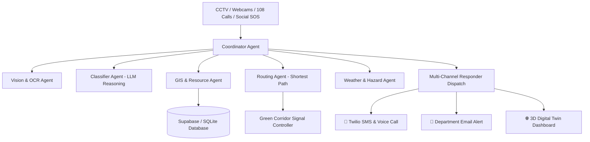

# 🛡️ Sentinel AI — Autonomous Public Safety & Emergency Response Agent

> **Winning Pitch:**  
> *"Sentinel AI is an autonomous emergency response ecosystem that detects incidents in real time, reasons about their severity using computer vision and multi-agent AI, coordinates multiple government departments, dispatches emergency services automatically via SMS, voice calls, and email, and continuously manages traffic green corridors until the incident is resolved—reducing emergency response times by 5–10 minutes and saving lives."*

---

## 📌 Problem Statement vs. Proactive Solution

| Traditional Emergency Response (Reactive) | Sentinel AI Autonomous Ecosystem (Proactive) |
| :--- | :--- |
| ❌ Delayed 108/112 phone calls from bystanders | ⚡ Continuous real-time multi-source monitoring (CCTV, Drones, IoT, SOS) |
| ❌ Manual dispatching takes 15–20 minutes | 🚀 Instant autonomous detection, severity classification & dispatch (< 2 seconds) |
| ❌ Ambulance stuck in heavy traffic | 🟢 Automated traffic signal preemption creating Green Corridors |
| ❌ Lack of coordination between Police, Fire & Hospitals | 🤖 Multi-Agent system simultaneously alerting Hospital, Police & Fire commands |

---

## 🔥 Key Features & Innovation Highlights

### 1. 📹 CCTV Live Tracking & YOLO AI Vision Station
- Real-time video stream processing with bounding box overlays for **car collisions**, **fire hazards**, **waterlogging/flooding**, and **crowd surges**.
- Live camera telemetry (FPS, inference latency, AI confidence score, GPS coordinates).
- 1-Click **"🚀 Trigger AI Analysis & Autonomous Dispatch"** directly from any live feed card.

### 2. 🚘 OCR Vehicle License Plate Extraction
- Reads license plates from CCTV crash frames in real time to assist traffic police and emergency responders.

### 3. 🎙️ Multi-Channel Autonomous Intake Hub
- **CCTV Frame Upload & Webcam Live Stream**: Direct frame analysis with YOLOv8 & Groq/Featherless Llama-3.3-70b.
- **108 Voice Emergency Call Ingest**: Speech-to-text transcript classification.
- **Social Media Citizen SOS Scanner**: Ingests citizen SOS posts and verifies location coordinates.

### 4. 🌐 3D Digital Twin City Command Map
- Displays live map markers for **Hospitals 🏥**, **Police Stations 🚓**, **Fire Stations 🚒**, and **Ambulances 🚑**.
- Visual polygon overlays for **Flood Risk & Fire Spread Zones**.
- Dynamic ambulance shortest-path navigation routes and green corridor signal indicators.

### 5. 🏢 Emergency Resource Insertion & Management Hub
- Section to register, view, update, and search emergency facilities.
- **📍 Quick Location Presets**: One-click coordinate fill for Hyderabad hotspots (*Jubilee Hills, Somajiguda, Secunderabad, Madhapur*).
- Real-time directory search bar to filter units by name, ID, or contact number.

### 6. 📱 Multi-Channel Dispatches (Twilio SMS/Calls + Email)
- Sends **real SMS text messages** and **automated voice calls** via Twilio REST API.
- Dispatches formatted **HTML emergency emails** to department inboxes (`police.hq@gov.in`, `trauma.center@apollo.org`, `fire.control@gov.in`).
- Simulated in-app dispatch console guarantees 100% reliable execution during live hackathon judging.

### 7. 🛡️ Supabase Database Sync & 6-Digit OTP Authentication
- Syncs all incidents, resources, and message logs to **Supabase Cloud Database**.
- Officer Access Portal with Supabase Auth **6-Digit OTP Verification Code Login**.

---

## 🤖 Multi-Agent System Architecture



---

## 🛠️ Technology Stack

- **Computer Vision & AI**: YOLOv8 (`ultralytics`), EasyOCR / OpenCV, Groq API, Featherless AI (`llama-3.3-70b-versatile`).
- **Backend Architecture**: Python 3.11, FastAPI, Uvicorn, SQLite3, Supabase SDK, Twilio REST API, SMTP Mailer.
- **Frontend Dashboard**: React 19, Vite, Vanilla CSS Glassmorphism Design System, Leaflet / CartoDB Dark Tiles, WebSockets.

---

## 🚀 Quick Start Guide

### Option 1: One-Click Launcher (Windows)
Double-click `start_sentinel.bat` or run in terminal:
```cmd
.\start_sentinel.bat
```

### Option 2: Manual Setup

#### 1. Backend Setup
```bash
cd backend
python -m venv venv
# On Windows PowerShell:
.\venv\Scripts\Activate.ps1
pip install -r requirements.txt
pip install supabase twilio uvicorn
uvicorn app.main:app --reload --port 8000
```

#### 2. Frontend Setup
```bash
cd frontend
npm install
npm run dev
```

Open [http://localhost:5174](http://localhost:5174) in your browser.

---

## ⚙️ Environment Variables (`.env`)

Create a `.env` file in `backend/` and `frontend/`:

### `backend/.env`
```env
GROQ_API_KEY=your_groq_api_key
TWILIO_ACCOUNT_SID=your_twilio_account_sid
TWILIO_AUTH_TOKEN=your_twilio_auth_token
TWILIO_FROM_NUMBER=your_twilio_phone_number
SUPABASE_KEY=your_supabase_key
SUPABASE_URL=https://your-project.supabase.co
SMTP_SERVER=smtp.gmail.com
SMTP_PORT=587
SMTP_USER=your_gmail@gmail.com
SMTP_PASS=your_app_password
```

### `frontend/.env`
```env
VITE_API_BASE_URL=http://127.0.0.1:8000
VITE_WS_URL=ws://127.0.0.1:8000/ws
VITE_SUPABASE_KEY=your_supabase_key
VITE_SUPABASE_URL=https://your-project.supabase.co
```

---

## 🏆 Pitch Demo Flow for Hackathon Judges

1. **Digital Twin Map (`🌐 3D Digital Twin Map`)**: Show the live 3D map with moving ambulances, police stations, hospitals, fire stations, and active green corridors.
2. **CCTV Live Tracking (`📹 CCTV Live Station`)**: Switch to the CCTV grid, toggle YOLO bounding box overlays, and click **"🚀 Trigger AI Dispatch"**.
3. **Multi-Agent Intake (`🚀 Multi-Agent Intake`)**: Upload an accident photo or enter a 108 voice transcript to demonstrate AI Vision classification, license plate extraction, and green corridor activation.
4. **Resource Management (`⚙️ Resources`)**: Register a new Hospital or Fire Station using quick location presets (*Jubilee Hills, Somajiguda, Secunderabad*).
5. **Real Dispatches (`💬 Real Messages`)**: Inspect live SMS, Voice Call, and Email alert logs with Supabase sync.
6. **Officer Authentication (`🔒 Officer OTP Login`)**: Demonstrate Supabase Auth 6-Digit OTP verification login.

---

## 📜 License
Developed for Hackathon Prototype Demonstration — Sentinel AI Autonomous Ecosystem.
